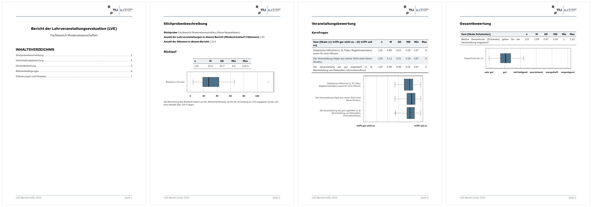
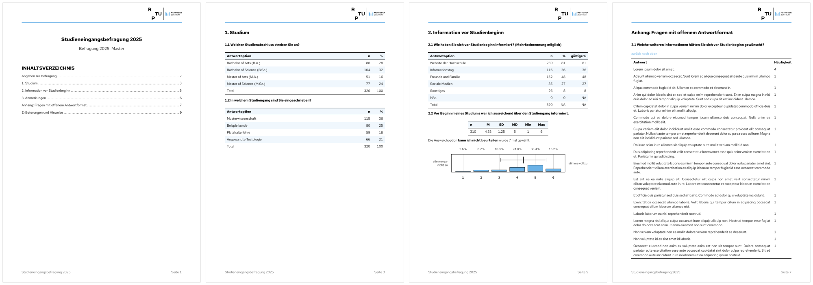

# set-template

**Deutsch** · [English](README.en.md)


[](LICENSE)

Quarto-Vorlage für personalisierte Evaluationsberichte als PDF, z. B. aus der
Lehrveranstaltungsevaluation oder aus Befragungen von Studierenden und Absolvent\*innen.
Die Auswertung übernimmt das R-Paket [setanalysis](https://github.com/donvollb/setanalysis):
Eine Zeile Code pro Frage erzeugt Überschrift, Tabelle und Abbildung. Diese Vorlage liefert
das Layout (Typst) und zwei lauffähige Beispielberichte mit zufällig erzeugten Beispieldaten.



## Funktionen

- **Typst-Format** mit Kopfzeile (Logo), Fußzeile, Seitenzahlen und Inhaltsverzeichnis
- **Eine Akzentfarbe** (`accent_col`) für Linien, Links, Logo, Hervorhebungen und die Grafiken aus setanalysis
- **Mehrere Berichte aus einer Datei:** Parameter `i` wählt den Bericht; die inkl.-Logik von setanalysis
  legt fest, welche Fragen in welchem Bericht erscheinen
- **Lange Tabellen brechen sauber um** (Tabellenkopf wird wiederholt), Überschriften rutschen mit dem folgenden Inhalt auf die nächste Seite
- **Offene Antworten im Anhang** mit Links hin und zurück

## Voraussetzungen

- [Quarto](https://quarto.org) ≥ 1.7 (enthält Typst)
- [R](https://www.r-project.org) mit dem Paket **setanalysis** (derzeit Entwicklungsstand):

  ```r
  # install.packages("pak")
  pak::pak("donvollb/setanalysis@dev")
  ```

- Schriftart **Red Hat Text** ([Google Fonts](https://fonts.google.com/specimen/Red+Hat+Text)).
  setanalysis bringt die Schrift für die Grafiken selbst mit; für den Text im PDF muss sie installiert sein.
  Am besten die Dateien aus dem Unterordner *static* installieren. Unter Windows ggf.
  *Für alle Benutzer installieren* wählen (alle *.ttf* markieren → Rechtsklick), damit Typst sie findet.

## Installation

Neues Projekt mit Vorlage und Beispielen anlegen:

```bash
quarto use template donvollb/set-template
```

Quarto fragt nach einem Ordnernamen und benennt `template.qmd` nach diesem Ordner um.
Nur das Format in ein bestehendes Projekt übernehmen:

```bash
quarto add donvollb/set-template
```

## Verwendung

```bash
quarto render template.qmd           # Bericht 1 (Parameter i aus dem YAML-Kopf)
quarto render template.qmd -P i:3    # Bericht 3
quarto render                        # alle Beispiele
```

Gerenderte Beispiele: [LVE-Bericht](vorschau/lve-bericht.pdf) ·
[Kohorte: Master-Bericht](vorschau/kohorte-master.pdf) ·
[Kohorte: Bericht „Sonderauswertung“](vorschau/kohorte-sonderauswertung.pdf)

## Aufbau

```
├── _extensions/set-template/   Format „set-template-typst“
│   ├── _extension.yml          Voreinstellungen (Seitenränder, Schrift, Farbe, Logo …)
│   ├── typst-template.typ      Layout: Kopf- und Fußzeile, Titel, Tabellen, Überschriften
│   ├── typst-show.typ          übergibt die Angaben aus dem YAML-Kopf an das Layout
│   ├── chunk-ausgabe.lua       erlaubt Seitenumbrüche in R-Chunks
│   └── images/                 Logos
├── template.qmd                Beispiel 1: LVE-Bericht pro Fachbereich
├── beispiele/kohorte.qmd       Beispiel 2: mehrere Berichte über Berichts- und Regeltabelle
├── daten/                      fiktive Beispieldaten, Berichts- und Regeltabelle
│   └── beispieldaten_erzeugen.R  erzeugt die Daten (zufällig, reproduzierbar)
└── vorschau/                   gerenderte Beispiel-PDFs und Vorschaubilder
```

### Beispiel 1: LVE-Bericht (`template.qmd`)

Ein Bericht pro Fachbereich: `params$i` wählt die Zeile der Info-Tabelle, die Daten werden auf den
Fachbereich gefiltert. Enthält Rücklauf, Fachsemester, Kernfragen (aggregiert je Lehrveranstaltung),
Gesamtnote, Workload und die Legenden.

### Beispiel 2: Mehrere Berichte mit unterschiedlichem Inhalt (`beispiele/kohorte.qmd`)

Für Befragungen, bei denen jeder Bericht (z. B. pro Studiengang) andere Fragen enthält:

1. Die **Berichtstabelle** enthält eine Zeile pro Bericht (Code, Abschluss, Studiengang, Titel …).
2. Die **Regeltabelle** legt pro Frage fest, wann sie erscheint, z. B. `inkl.1.3` →
   `Abschluss == "Bachelor of Science (B.Sc.)"`.
3. `input_tabelle()` berechnet daraus `TRUE`/`FALSE` je Bericht und Frage. Die Vorlage setzt die
   Werte als Variablen; `merge_sc(…, nr = "1.3")` fragt dann `inkl.1.3` ab, ganze Abschnitte werden
   über `eval: !expr header1` ein- oder ausgeblendet.

Die beiden Tabellen liegen als `daten/kohorte_berichte.xlsx` und `daten/kohorte_regeln.xlsx` bei.

### Beispieldaten

Alle Daten in `daten/` sind zufällig erzeugt; Fachbereiche und Studiengänge sind erfunden, offene
Antworten bestehen aus Lorem ipsum. Die Variablen haben dieselben Attribute wie Daten aus
`evasys_read_data()` (Fragetext, Fragenummer, Fragetyp, Antwortcodes). Neu erzeugen lassen sie sich mit
`Rscript beispieldaten_erzeugen.R` im Ordner `daten/` (benötigt zusätzlich das Paket writexl).



## Anpassen

### Angaben im YAML-Kopf

| Feld          | Bedeutung                                              | Voreinstellung                    |
|---------------|--------------------------------------------------------|-----------------------------------|
| `title`, `subtitle` | Titel auf der ersten Seite (`subtitle` lässt sich pro Bericht aus R setzen, siehe Beispiele) | – |
| `lfoot`       | Text links in der Fußzeile                             | leer                              |
| `accent_col`  | Akzentfarbe für Layout und Grafiken                    | `"#507289"`                       |
| `header-logo` | Logo rechts in der Kopfzeile (SVG)                     | `images/Logo Meze - Cobranding.svg` |
| `toc`, `toc-title`, `toc-depth` | Inhaltsverzeichnis                   | `true`, `INHALTSVERZEICHNIS`, `1` |
| `margin`, `fontsize`, `mainfont` | Seitenränder und Schrift            | 2/3/2 cm, `10pt`, `Red Hat Text`  |
| `params: i`   | welcher Bericht erstellt wird                          | `1`                               |

Im Logo wird die Farbe `#006a6a` durch die Akzentfarbe ersetzt. Ein anderes Logo lässt sich mit
`header-logo: pfad/zum/logo.svg` (relativ zum Dokument) einbinden.

RPTU-Farben für `accent_col`:

| Farbe              | Code      | Farbe              | Code      |
|--------------------|-----------|--------------------|-----------|
| Schiefer (blaugrau)| `#507289` | Petrol (dunkelgrün)| `#006b6b` |
| Ozean (grüngrau)   | `#77b6ba` | Apfel (hellgrün)   | `#26d07c` |
| Nacht (dunkelblau) | `#042c58` | Pflaume (violett)  | `#4c3575` |
| Tag (hellblau)     | `#6ab2e7` | Fuchsia (pink)     | `#d13896` |
| Himbeere (rot)     | `#e31b4c` | Mango (orange)     | `#ffa252` |

### Bausteine im Bericht

- Auswertungsfunktionen aus setanalysis in R-Chunks, z. B. `merge_sc()`, `merge_mc()`, `merge_sk()`,
  `merge_aggr_sk()`, `merge_open()`; Überblick mit `?setanalysis`.
- `appendix_open()` gehört ans Ende jedes Berichts (gibt die gesammelten offenen Antworten aus).
- Seitenumbruch: `` im Text oder in einem Chunk.
- Typst-Hilfsfunktionen der Vorlage: `#begriff[…]` (hervorgehobener Begriff in der Akzentfarbe),
  `#hinweis[…]` (kleiner Hinweistext), jeweils in einem ```` ```{=typst} ````-Block.

## Geplant

- Beispielskript, das alle Berichte einer Befragung nacheinander rendert und protokolliert

## Lizenz

**Code:** [MIT License](LICENSE)

**Logos:** Eigentum der [RPTU (Rheinland-Pfälzische Technische Universität Kaiserslautern-Landau)](https://rptu.de)
